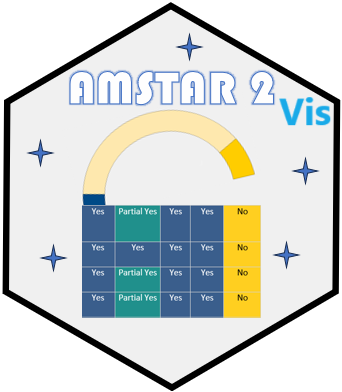
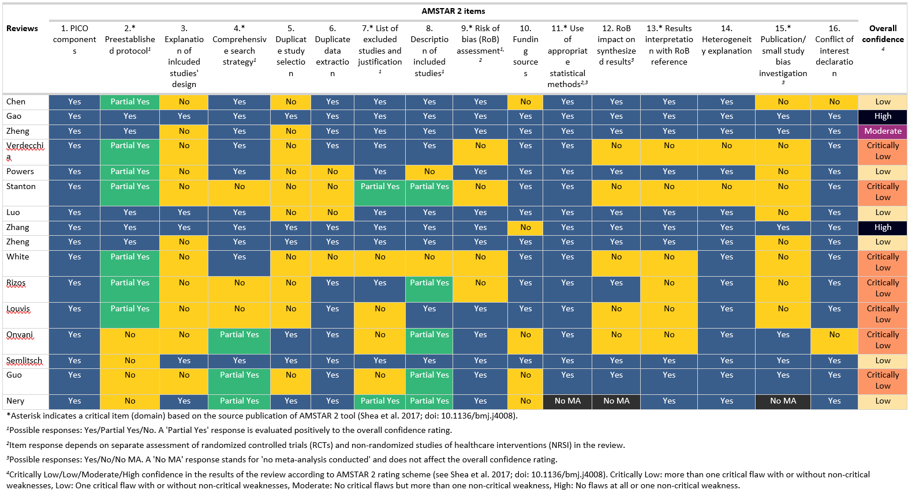
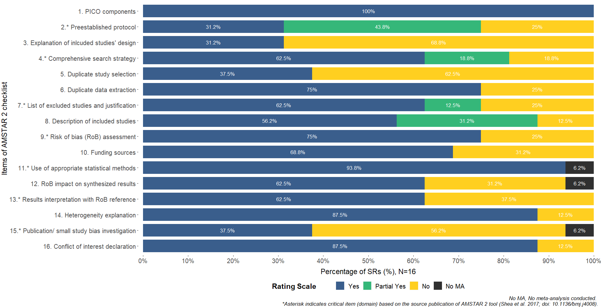
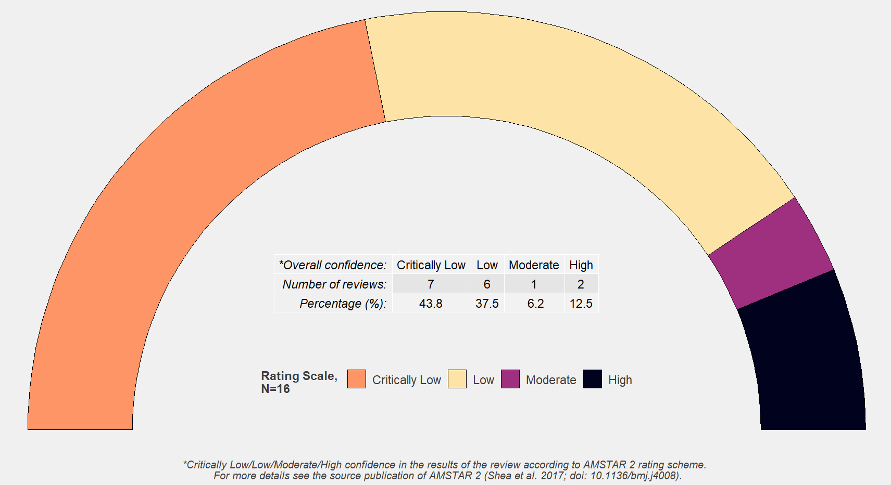

# amstar2 
A package for the AMSTAR 2 checklist.


## Overview
It creates tables and presents graphical visualizations of the assessment of systematic reviews according to AMSTAR 2 checklist.


## Installation

``` r
# You can download the development version of the package from github:
devtools::install_github('bougioukas/amstar2')
```

Load the package:

``` r
library(amstar2)
```

## Read the example data

``` r
DATASET <- readxl::read_excel(system.file("extdata", "sample_dat.xlsx", package = "amstar2"))

```

## AMSTAR 2 "gt" Table

``` r
amstar2_gtable(DATASET)
```




## AMSTAR 2 Barplot

``` r
amstar2_barplot(DATASET)
```




## AMSTAR 2 Overall

``` r
amstar2_overall(DATASET)
```




